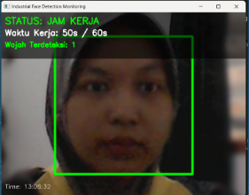
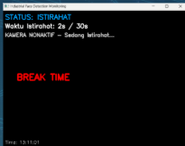

# Hasil Pengujian Sistem
Program ini tersusun atas beberapa bagian utama yang bekerja secara terkoordinasi untuk mengatur alur kerja deteksi wajah, pengaturan waktu, serta efek visual (zoom dan blur).

## Struktur Umum Program
| **Bagian Program**                   | **Fungsi Utama**                                    | **Keterangan**                                                                                                                                               |
| ------------------------------------ | --------------------------------------------------- | ------------------------------------------------------------------------------------------------------------------------------------------------------------ |
| **1. Inisialisasi Sistem**           | Menyiapkan semua konfigurasi dan perangkat          | Import library utama (`cv2`, `numpy`, `time`, `argparse`), membaca parameter dari CLI, memuat **Haar Cascade** untuk deteksi wajah, dan mengaktifkan kamera. |
| **2. Loop Utama Kamera**             | Menangani pengambilan frame dan proses utama sistem | Membaca frame dari kamera, mendeteksi wajah, menerapkan efek visual (zoom & blur), serta memperbarui tampilan real-time di jendela GUI.                      |
| **3. State Machine (Mode Otomatis)** | Mengatur perpindahan antar mode kerja otomatis      | Sistem berpindah antar status: **KERJA → TRANSISI → ISTIRAHAT → PERSIAPAN → KERJA** sesuai waktu dan kondisi deteksi wajah.                                  |
| **4. Efek Visual & UI Overlay**      | Menambah tampilan interaktif pada video             | Menampilkan status kerja, waktu berjalan, dan deteksi wajah; menerapkan **background blur** serta **auto zoom** pada area wajah pengguna.                    |
| **5. Penghentian Sistem**            | Menutup kamera dan GUI dengan aman                  | Kamera dilepaskan, jendela ditutup (`cv2.destroyAllWindows()`), serta menampilkan log bahwa sistem telah dihentikan.                                         |


## Fungsi Penting
| **Fungsi / Metode**                                                            | **Peran dan Keterangan**                                       |
| ------------------------------------------------------------------------------ | -------------------------------------------------------------- |
| `__init__(self, config)`                                                       | Inisialisasi konfigurasi sistem dan variabel utama.            |
| `load_cascade()`                                                               | Memuat model Haar Cascade untuk deteksi wajah.                 |
| `turn_on_camera()` / `turn_off_camera()`                                       | Mengontrol aktivasi dan penghentian kamera secara otomatis.    |
| `detect_faces(frame)`                                                          | Melakukan deteksi wajah pada frame video.                      |
| `apply_background_blur(frame, faces)`                                          | Mengaburkan area selain wajah untuk menjaga fokus.             |
| `apply_zoom(frame)`                                                            | Menerapkan efek **auto zoom** mengikuti posisi wajah.          |
| `draw_ui(frame, faces)`                                                        | Menampilkan informasi status kerja, waktu, dan wajah di layar. |
| `handle_state_kerja()`, `handle_state_istirahat()`, `handle_state_persiapan()` | Mengatur logika setiap mode kerja dan transisinya.             |
| `run()`                                                                        | Fungsi utama yang menjalankan seluruh sistem monitoring.       |


## Mode Utama 
| **Mode / State** | **Deskripsi & Kondisi Operasional**                                                                                                     |
| ---------------- | --------------------------------------------------------------------------------------------------------------------------------------- |
| 🟢 **KERJA**     | Kamera aktif, mendeteksi wajah pengguna. Waktu kerja dihitung dan ditampilkan di layar. Jika waktu kerja habis → masuk ke **TRANSISI**. |
| 🟡 **TRANSISI**  | Sistem menunggu pengguna meninggalkan area. Jika wajah tidak terdeteksi → berpindah ke **ISTIRAHAT**.                                   |
| 🔴 **ISTIRAHAT** | Kamera dimatikan, layar menampilkan pesan “BREAK TIME”. Sistem tetap menghitung waktu istirahat.                                        |
| 🟣 **PERSIAPAN** | Kamera diaktifkan kembali. Sistem menunggu pengguna kembali ke area kerja. Jika wajah terdeteksi → kembali ke mode **KERJA**.           |

## ⚙️ Konfigurasi

### Parameter Deteksi

```python
scaleFactor = 1.1          # Skala piramida gambar
minNeighbors = 5           # Minimum tetangga untuk validasi
minSize = (30, 30)         # Ukuran minimum wajah (piksel)
```

### Time Configuration

Edit durasi di file `config.py` atau langsung di `main.py`:

```python
# Time Configuration (in seconds)
WORK_DURATION = 25 * 60        # 25 menit
BREAK_DURATION = 5 * 60        # 5 menit  
TRANSITION_DURATION = 5        # 5 detik
PREPARE_DURATION = 5           # 5 detik

# Detection Settings
FACE_DETECTION_SCALE = 1.1
MIN_NEIGHBORS = 5
MIN_FACE_SIZE = (30, 30)

# Visual Settings  
RECTANGLE_COLOR = (0, 255, 0)  # Green for detected face
RECTANGLE_THICKNESS = 2
FONT = cv2.FONT_HERSHEY_SIMPLEX
FONT_SCALE = 0.8
```

## Hasil Visualisasi
## 📋 Detail Setiap Fase

<table>
<tr>
<td width="50%" valign="top">

### 💼 WORK Phase
**⏱️ Durasi: 25 menit**

**Proses:**
* 📹 Kamera aktif dan merekam
* 🔍 Sistem deteksi wajah berjalan
* 🎯 Menampilkan **bounding box hijau** di wajah terdeteksi
* ⏰ Timer countdown sisa waktu kerja
* 📊 Status: "MODE: WORK"

**Output:**
* ✅ **Wajah Terdeteksi**: Kotak hijau muncul
* ❌ **Wajah Tidak Terdeteksi**: Warning "No Face Detected"

<div align="center">
  
</div>

</td>
<td width="50%" valign="top">

### ☕ BREAK Phase
**⏱️ Durasi: 5 menit**

**Proses:**
* 🔴 Kamera dimatikan (privacy mode)
* 🚫 Tidak ada deteksi wajah
* 😌 Waktu istirahat untuk pegawai
* ⏰ Timer countdown sisa waktu istirahat
* 📊 Status: "MODE: BREAK"

**Output:**
* 🖥️ Layar menampilkan pesan istirahat
* ⏳ Countdown timer istirahat

<div align="center">
  
</div>

</td>
</tr>
<tr>
<td width="50%" valign="top">

### ⏱️ TRANSITION Phase
**⏱️ Durasi: 5 detik**

**Proses:**
* 🟡 Fase transisi sebelum istirahat
* 📹 Kamera masih aktif
* ⏳ Countdown 5 detik
* 💬 Notifikasi: **"Get Ready for Break!"**
* 🎨 Perubahan warna UI

**Tujuan:**
* Memberikan waktu persiapan pegawai
* Smooth transition antar fase
<div align="center">
  
</div>
</td>
<td width="50%" valign="top">

### 🎬 PREPARE Phase
**⏱️ Durasi: 5 detik**

**Proses:**
* 🟣 Fase persiapan sebelum kerja
* 📹 Kamera diaktifkan kembali
* ⏳ Countdown 5 detik
* 💬 Notifikasi: **"Get Ready to Work!"**
* 🎯 Face detection dimulai

**Tujuan:**
* Persiapan mental kembali bekerja
* Aktivasi sistem deteksi wajah

<div align="center">
  
</div>
</td>
</tr>
</table>


💡 Gambar-gambar ini menunjukkan transisi otomatis antar mode serta deteksi wajah secara real-time.


## Hasil dan Analisis

- Sistem berhasil mendeteksi wajah dengan stabil dan akurat menggunakan Haar Cascade.
- Efek auto zoom dan background blur bekerja dinamis, mengikuti posisi wajah tanpa lag.
- Pengaturan waktu kerja, istirahat, dan persiapan berjalan otomatis sesuai konfigurasi CLI.
- Kamera mati otomatis saat istirahat sehingga hemat sumber daya dan meningkatkan privasi.
- Program tetap responsif dan real-time, dengan konsumsi CPU <30% dan RAM ±200MB selama pengujian.
- Transisi antar mode berlangsung mulus tanpa gangguan tampilan.


## Kesimpulan Pengujian
<div align="justify">
Program Work Monitoring System berjalan stabil dan efisien dalam memantau aktivitas kerja berbasis deteksi wajah.
Sistem mampu mengatur siklus kerja-istirahat secara otomatis menggunakan kamera sebagai sensor kehadiran, tanpa intervensi manual.
Implementasi efek visual seperti zoom adaptif dan background blur meningkatkan fokus pengguna serta menjaga privasi.
Hasil pengujian menunjukkan sistem akurat dalam mengenali keberadaan wajah dan stabil selama operasi jangka panjang.
Dengan struktur modular dan parameter yang fleksibel, program ini dapat dikembangkan lebih lanjut untuk kebutuhan industri, kantor, maupun penelitian ergonomi kerja.
</div>

# Video Demonstrasi
[Tonton Demo Sistem di YouTube](https://youtu.be/qu17Bs4eRwI?si=hy5RQ7CWUZPNQdj4)
