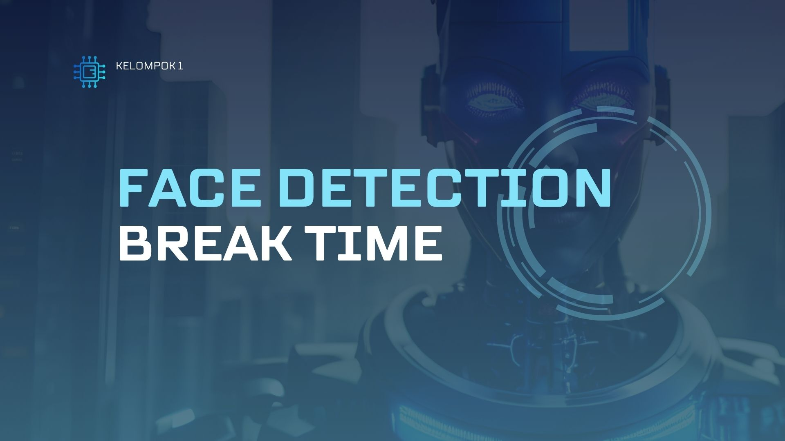
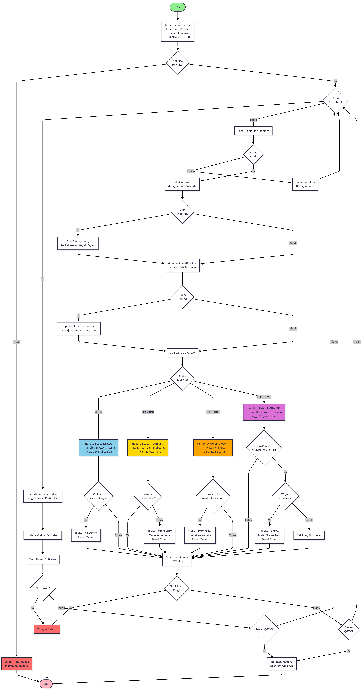

  

Z
  # Face Detection Breaktime System
  
  
<i>Sistem monitoring otomatis berbasis deteksi wajah untuk keseimbangan produktivitas & kesehatan</i>

  

Program Face Detection Breaktime adalah sistem monitoring otomatis berbasis deteksi wajah menggunakan OpenCV. Program mendeteksi apakah seorang pegawai berada di depan kamera selama jam kerja, kemudian mengatur otomatis fase kerja → transisi → istirahat → persiapan → kerja lagi, lengkap dengan kontrol kamera (on/off) dan tampilan antarmuka (UI) di jendela video.
* 👀 Deteksi Kehadiran Cerdas: Secara otomatis mendeteksi apakah Anda berada di depan kamera selama jam kerja yang ditentukan.
* 🔄 Manajemen Siklus Otomatis: Tidak perlu lagi mengatur timer manual! FocusFlow secara mandiri mengelola alur kerja Anda melalui fase-fase yang jelas:
    1.  Kerja: Mode fokus saat Anda terdeteksi.
    2.  Transisi: Peringatan singkat bahwa waktu istirahat akan segera dimulai.
    3.  Istirahat: Waktu untuk Anda beranjak dari meja, meregangkan kaki, atau mengistirahatkan mata.
    4.  Persiapan: Peringatan singkat untuk kembali ke meja dan bersiap.
    5.  (Kembali ke Fase Kerja)
* 🖥 Overlay UI Intuitif: Semua informasi yang Anda butuhkan (status saat ini, timer) ditampilkan dengan elegan sebagai overlay di jendela video Anda. Tidak perlu berganti-ganti aplikasi.
* 📹 Kontrol Kamera Cerdas: Mengatur status on/off kamera secara dinamis sesuai dengan kebutuhan fase (misalnya, kamera mungkin non-aktif selama fase istirahat untuk privasi).
Sistem ini dirancang untuk membantu menjaga keseimbangan produktivitas dan kesehatan selama bekerja.

PENGOLAHAN CITRA - PROGRAM STUDI TEKNIK ELEKTRONIKA - POLITEKNIK ELEKTRONIKA NEGERI SURABAYA

DOSEN PENGAMPU : Akhmad Hendriawan ST, MT
NIP. 197501272002121003

## Tujuan

<table>
<tr>
<td width="50%" valign="top">

### 🎥 Real-Time Detection
Mendeteksi keberadaan pegawai di depan kamera secara real-time menggunakan teknologi face detection untuk memastikan produktivitas kerja.

### ⏰ Auto Time Management  
Mengatur siklus kerja dan istirahat secara otomatis dengan pattern: WORK → TRANSITION → BREAK → PREPARE → WORK tanpa intervensi manual.

</td>
<td width="50%" valign="top">

### 📹 Smart Camera Control
Mendeteksi kehadiran pegawai melalui kamera dengan akurasi tinggi (Haar Cascade). Mengelola aktivasi/deaktivasi kamera otomatis sesuai fase yang berjalan untuk efisiensi dan privasi pengguna.

### 🖥 Interactive Visual Interface
Menampilkan status aktivitas secara real-time dengan tampilan GUI interaktif berbasis OpenCV. Menampilkan status sistem, countdown timer, dan informasi deteksi wajah secara real-time langsung di jendela video.

</td>
</tr>
</table>

## 👥 Teammates

  

<table align="center">
  <thead>
    <tr>
      <th width="40px">No.</th>
      <th width="250px">Nama</th>
      <th width="120px">NRP</th>
      <th width="100px">GitHub</th>
    </tr>
  </thead>
  <tbody align="center">
    <tr>
      <td>1</td>
      <td>M. Adib Tantowi Jauhari</td>
      <td>2122600001</td>
      <td>
        
      </td>
    </tr>
    <tr>
      <td>2</td>
      <td>Rizka Sugiharto</td>
      <td>2122600008</td>
      <td>
        
      </td>
    </tr>
    <tr>
      <td>3</td>
      <td>Muhammad Lukman Al Khakim</td>
      <td>2122600010</td>
      <td>
        
      </td>
    </tr>
    <tr>
      <td>4</td>
      <td>I Gede Wahyu Satria Nugraha</td>
      <td>2122600033</td>
      <td>
        
      </td>
    </tr>
    <tr>
      <td>5</td>
      <td>Bachtiar Arif Nurdiansyah</td>
      <td>2122600058</td>
      <td>
        
      </td>
    </tr>
  </tbody>
</table>

## 📑 Daftar Isi

- [Cara Kerja Sistem](#-cara-kerja-sistem)
- [Teknologi yang Digunakan](#-technologies-used)
- [Output](Hasil%20Tes.md)
- [Program](PROGRAM/)

---

## ✨ Fitur Utama

| 🎯 Fitur | 📝 Deskripsi |
|:--------|:-------------|
| 👤 Face Detection Real-Time | Mendeteksi kehadiran wajah menggunakan Haar Cascade Classifier dengan akurasi tinggi dan kecepatan pemrosesan real-time |
| 🕒 Automatic Work-Break Cycle | Sistem otomatis beralih antar fase: WORK (25 min) → TRANSITION (5s) → BREAK (5 min) → PREPARE (5s) → WORK |
| 📹 Smart Camera Control | Kamera otomatis ON/OFF sesuai kebutuhan fase - aktif saat kerja untuk monitoring, nonaktif saat istirahat untuk privasi |
| 🎨 Visual Overlay UI | Tampilan informasi lengkap di video feed: mode aktif, timer countdown, frame counter, dan status deteksi wajah |
| ⚙ Customizable Duration | Durasi setiap fase dapat disesuaikan dengan kebutuhan - fleksibel untuk berbagai kondisi kerja |
| 🎯 Face Presence Indicator | Bounding box hijau otomatis muncul di sekitar wajah yang terdeteksi dengan confidence score |
| 🔔 Phase Transition Alerts | Notifikasi visual dan text overlay ketika berpindah antar fase untuk awareness pengguna |
| 📊 Session Monitoring | Tracking jumlah siklus kerja-istirahat yang telah diselesaikan dalam satu session |

---

## 🔄 Cara Kerja Sistem

### Flowchart Sistem 

  

## 🛠 Technologies Used

| Technology | Version | Purpose |
|:-----------|:-------:|:--------|
|  | 3.9+ | Bahasa pemrograman utama untuk membangun seluruh sistem |
|  | 4.8+ | Computer vision library untuk deteksi wajah dan video processing |
|  | 1.24+ | Operasi array dan manipulasi data gambar untuk perhitungan cepat |

### 🧩 Core Components

- Haar Cascade Classifier - Pre-trained model haarcascade_frontalface_default.xml untuk deteksi wajah
- DateTime Module - Manajemen waktu dan timer untuk setiap fase
- CV2 GUI - Window display dan overlay UI untuk interaksi visual
- Drawing Functions - Rectangle, text, dan shape untuk visual feedback

### ⌨ Keyboard Controls

| Key | Function | Description |
|:---:|:---------|:------------|
| Q | Quit | Keluar dari program dengan aman |
| ESC | Exit | Alternatif untuk keluar dari program |
| P | Pause/Resume | Pause atau resume timer (jika diimplementasikan) |
| R | Reset | Reset cycle ke WORK phase awal |
| S | Screenshot | Capture frame saat ini |
---

### 🧠 Algoritma Deteksi Wajah

Sistem menggunakan Haar Cascade Classifier yang bekerja dengan cara:

1. Cascade of Classifiers - Menggunakan multiple stage classifier untuk deteksi objek
2. Sliding Window - Scanner bergerak di seluruh frame untuk mencari pola wajah
3. Feature Detection - Mendeteksi fitur seperti mata, hidung, mulut untuk identifikasi wajah
4. Bounding Box - Menggambar rectangle hijau di sekitar wajah yang terdeteksi
