<div align="center">
  
  
  # 🎯 Face Detection Breaktime System
  
  <p><i>Sistem monitoring otomatis berbasis deteksi wajah untuk keseimbangan produktivitas & kesehatan</i></p>
  
  
  
  
  
</div>

Program **Face Detection Breaktime** adalah sistem monitoring otomatis berbasis deteksi wajah menggunakan OpenCV. Program mendeteksi apakah seorang pegawai berada di depan kamera selama jam kerja, kemudian mengatur otomatis fase kerja → transisi → istirahat → persiapan → kerja lagi, lengkap dengan kontrol kamera (on/off) dan tampilan antarmuka (UI) di jendela video. Sistem ini dirancang untuk membantu menjaga keseimbangan produktivitas dan kesehatan selama bekerja.

`PENGOLAHAN CITRA - PROGRAM STUDI TEKNIK ELEKTRONIKA - POLITEKNIK ELEKTRONIKA NEGERI SURABAYA`

`DOSEN PENGAMPU : Akhmad Hendriawan ST, MT`
`NIP. 197501272002121003`

## 🎯 Tujuan

<table>
<tr>
<td width="50%" valign="top">

### 🎥 Real-Time Detection
Mendeteksi keberadaan pegawai di depan kamera secara real-time menggunakan teknologi face detection untuk memastikan produktivitas kerja.

### ⏰ Auto Time Management  
Mengatur siklus kerja dan istirahat secara otomatis dengan pattern: **WORK → TRANSITION → BREAK → PREPARE → WORK** tanpa intervensi manual.

</td>
<td width="50%" valign="top">

### 📹 Smart Camera Control
Mengelola aktivasi/deaktivasi kamera otomatis sesuai fase yang berjalan untuk efisiensi dan privasi pengguna.

### 🖥️ Interactive Visual Interface
Menampilkan status sistem, countdown timer, dan informasi deteksi wajah secara real-time langsung di jendela video.

</td>
</tr>
</table>

---

## 📑 Daftar Isi

- [Cara Kerja Sistem](#-cara-kerja-sistem)
- [Teknologi yang Digunakan](#️-technologies-used)
- [Demo Sistem](#️-screenshots)
- [Output](HASIL_TES.md)
- [Program](PROGRAM/)

---

## ✨ Fitur Utama

| 🎯 Fitur | 📝 Deskripsi |
|:--------|:-------------|
| **👤 Face Detection Real-Time** | Mendeteksi kehadiran wajah menggunakan Haar Cascade Classifier dengan akurasi tinggi dan kecepatan pemrosesan real-time |
| **🕒 Automatic Work-Break Cycle** | Sistem otomatis beralih antar fase: WORK (25 min) → TRANSITION (5s) → BREAK (5 min) → PREPARE (5s) → WORK |
| **📹 Smart Camera Control** | Kamera otomatis ON/OFF sesuai kebutuhan fase - aktif saat kerja untuk monitoring, nonaktif saat istirahat untuk privasi |
| **🎨 Visual Overlay UI** | Tampilan informasi lengkap di video feed: mode aktif, timer countdown, frame counter, dan status deteksi wajah |
| **⚙️ Customizable Duration** | Durasi setiap fase dapat disesuaikan dengan kebutuhan - fleksibel untuk berbagai kondisi kerja |
| **🎯 Face Presence Indicator** | Bounding box hijau otomatis muncul di sekitar wajah yang terdeteksi dengan confidence score |
| **🔔 Phase Transition Alerts** | Notifikasi visual dan text overlay ketika berpindah antar fase untuk awareness pengguna |
| **📊 Session Monitoring** | Tracking jumlah siklus kerja-istirahat yang telah diselesaikan dalam satu session |

---

## 🔄 Cara Kerja Sistem

### Alur Sistem

```mermaid
graph TD
    A[🚀 Program Start] --> B[📹 Initialize Camera]
    B --> C[🧠 Load Face Detector]
    C --> D[💼 WORK Phase - 25 min]
    
    D --> |Camera ON| D1[Detect Face]
    D1 --> |Face Found| D2[✅ Show Green Rectangle]
    D1 --> |No Face| D3[⚠️ Alert: No Presence]
    D2 --> D4[Update Timer]
    D3 --> D4
    D4 --> |Time Up| E
    
    E[⏱️ TRANSITION - 5s] --> F[☕ BREAK Phase - 5 min]
    F --> |Camera OFF| F1[Privacy Mode]
    F1 --> |Time Up| G
    
    G[🎬 PREPARE - 5s] --> H[Camera ON]
    H --> |Ready| D
    
    style D fill:#4CAF50,color:#fff
    style F fill:#FF9800,color:#fff
    style E fill:#2196F3,color:#fff
    style G fill:#9C27B0,color:#fff
```

<div align="center">



</div>

### Flowchart Sistem 

<div align="center">
  
</div>

---

## 📋 Detail Setiap Fase

<table>
<tr>
<td width="50%" valign="top">

### 💼 WORK Phase
**⏱️ Durasi: 25 menit**

**Proses:**
- 📹 Kamera aktif dan merekam
- 🔍 Sistem deteksi wajah berjalan
- 🎯 Menampilkan **bounding box hijau** di wajah terdeteksi
- ⏰ Timer countdown sisa waktu kerja
- 📊 Status: "MODE: WORK"

**Output:**
- ✅ **Wajah Terdeteksi**: Kotak hijau muncul
- ❌ **Wajah Tidak Terdeteksi**: Warning "No Face Detected"

<div align="center">
  
</div>

</td>
<td width="50%" valign="top">

### ☕ BREAK Phase
**⏱️ Durasi: 5 menit**

**Proses:**
- 🔴 Kamera dimatikan (privacy mode)
- 🚫 Tidak ada deteksi wajah
- 😌 Waktu istirahat untuk pegawai
- ⏰ Timer countdown sisa waktu istirahat
- 📊 Status: "MODE: BREAK"

**Output:**
- 🖥️ Layar menampilkan pesan istirahat
- ⏳ Countdown timer istirahat

<div align="center">
  
</div>

</td>
</tr>
<tr>
<td width="50%" valign="top">

### ⏱️ TRANSITION Phase
**⏱️ Durasi: 5 detik**

**Proses:**
- 🟡 Fase transisi sebelum istirahat
- 📹 Kamera masih aktif
- ⏳ Countdown 5 detik
- 💬 Notifikasi: **"Get Ready for Break!"**
- 🎨 Perubahan warna UI

**Tujuan:**
- Memberikan waktu persiapan pegawai
- Smooth transition antar fase

</td>
<td width="50%" valign="top">

### 🎬 PREPARE Phase
**⏱️ Durasi: 5 detik**

**Proses:**
- 🟣 Fase persiapan sebelum kerja
- 📹 Kamera diaktifkan kembali
- ⏳ Countdown 5 detik
- 💬 Notifikasi: **"Get Ready to Work!"**
- 🎯 Face detection dimulai

**Tujuan:**
- Persiapan mental kembali bekerja
- Aktivasi sistem deteksi wajah

</td>
</tr>
</table>

<div align="center">
  
  <p><i>Countdown transisi antar fase</i></p>
</div>

---

## 🛠️ Technologies Used

| Technology | Version | Purpose |
|:-----------|:-------:|:--------|
|  | 3.9+ | Bahasa pemrograman utama untuk membangun seluruh sistem |
|  | 4.8+ | Computer vision library untuk deteksi wajah dan video processing |
|  | 1.24+ | Operasi array dan manipulasi data gambar untuk perhitungan cepat |

### 🧩 Core Components

- **🎭 Haar Cascade Classifier** - Pre-trained model `haarcascade_frontalface_default.xml` untuk deteksi wajah
- **⏰ DateTime Module** - Manajemen waktu dan timer untuk setiap fase
- **🖼️ CV2 GUI** - Window display dan overlay UI untuk interaksi visual
- **🎨 Drawing Functions** - Rectangle, text, dan shape untuk visual feedback

---

## 🧠 Algoritma Deteksi Wajah

Sistem menggunakan **Haar Cascade Classifier** yang bekerja dengan cara:

1. **Cascade of Classifiers** - Menggunakan multiple stage classifier untuk deteksi objek
2. **Sliding Window** - Scanner bergerak di seluruh frame untuk mencari pola wajah
3. **Feature Detection** - Mendeteksi fitur seperti mata, hidung, mulut untuk identifikasi wajah
4. **Bounding Box** - Menggambar rectangle hijau di sekitar wajah yang terdeteksi

---

## ⌨️ Keyboard Controls

| Key | Function | Description |
|:---:|:---------|:------------|
| `Q` | Quit | Keluar dari program dengan aman |
| `ESC` | Exit | Alternatif untuk keluar dari program |
| `P` | Pause/Resume | Pause atau resume timer (jika diimplementasikan) |
| `R` | Reset | Reset cycle ke WORK phase awal |
| `S` | Screenshot | Capture frame saat ini |

---

## ⚙️ Konfigurasi

### Parameter Deteksi

```python
scaleFactor = 1.1          # Skala piramida gambar
minNeighbors = 5           # Minimum tetangga untuk validasi
minSize = (30, 30)         # Ukuran minimum wajah (piksel)
```

### Time Configuration

Edit durasi di file `config.py` atau langsung di `main.py`:

```python
# Time Configuration (in seconds)
WORK_DURATION = 25 * 60        # 25 menit
BREAK_DURATION = 5 * 60        # 5 menit  
TRANSITION_DURATION = 5        # 5 detik
PREPARE_DURATION = 5           # 5 detik

# Detection Settings
FACE_DETECTION_SCALE = 1.1
MIN_NEIGHBORS = 5
MIN_FACE_SIZE = (30, 30)

# Visual Settings  
RECTANGLE_COLOR = (0, 255, 0)  # Green for detected face
RECTANGLE_THICKNESS = 2
FONT = cv2.FONT_HERSHEY_SIMPLEX
FONT_SCALE = 0.8
```

---

## 🖼️ Screenshots

### 💼 Work Phase - Face Detected

<div align="center">
  
  <p><i>Kamera aktif, wajah terdeteksi dengan bounding box hijau, timer menunjukkan sisa waktu kerja</i></p>
</div>

### ☕ Break Phase

<div align="center">
  
  <p><i>Kamera nonaktif, layar menampilkan waktu istirahat dan pesan relaksasi</i></p>
</div>

### ⏱️ Transition Phase

<div align="center">
  
  <p><i>Countdown 5 detik sebelum memasuki fase berikutnya</i></p>
</div>

---

## 👥 Teammates

<div align="center">
  
</div>

| No. | Nama | NRP | GitHub |
|:---:|:-----|:---:|:------:|
| 1 | M. Adib Tantowi Jauhari | 2122600001 | [](https://github.com/AdibTantowi) |
| 2 | Rizka Sugiharto | 2122600008 | [](https://github.com/Rizka-sgh) |
| 3 | Muhammad Lukman Al Khakim | 2122600010 | [](https://github.com/lukmanhakim100523-droid) |
| 4 | I Gede Wahyu Satria Nugraha | 2122600033 | [](https://github.com/Gedewsnnn) |
| 5 | Bachtiar Arif Nurdiansyah | 2122600058 | [](https://github.com/BachtiarArif) |

---

## 🎓 Academic Information

<div align="center">

**📚 Mata Kuliah:** Pengolahan Citra  
**🏫 Program Studi:** D4 Teknik Elektronika  
**🏛️ Institusi:** Politeknik Elektronika Negeri Surabaya  
**👨‍🏫 Dosen Pengampu:** Akhmad Hendriawan ST., MT.  
**🆔 NIP:** 197501272002121003

</div>

---

<div align="center">

### ⭐ Jangan lupa berikan star jika project ini bermanfaat! ⭐


---

**Made with ❤️ by Team Elektronika PENS**

**© 2024 Politeknik Elektronika Negeri Surabaya**

</div>
